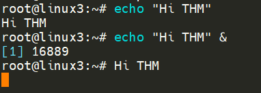
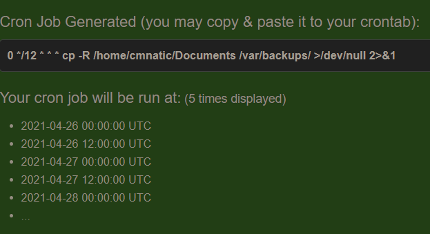

# Terminal Text Editors

Throughout the series so far, we have only stored text in files using a combination of the `echo` command and the pipe operators (`>` and `>>`). This isn't an efficient way to handle data when you're working with files with multiple lines and the sorts!

## Introducing terminal editors
There are a few options that you can use, all with a variety of friendliness and utility. This task is going to introduce you to `nano` but also show you an alternative named `VIM`

### Nano
It is easy to get started with Nano! To create or edit a file using nano, we simply use `nano [filename]`


```
:/tmp# nano myfile
GNU nano 4.8                                             myfile                                                       


^G Get Help    ^O Write Out   ^W Where Is    ^K Cut Text    ^J Justify     ^C Cur Pos     M-U Undo       M-A Mark Text
^X Exit        ^R Read File   ^\ Replace     ^U Paste Text  ^T To Spell    ^_ Go To Line  M-E Redo       M-6 Copy Text
```

Once we press the enter to execute the command, `nano` will launch! Where we can just begin to start entering or modifying our text. You can navigate each line using the "up" and "down" arrow keys or start a new line using the "Enter" key on your keyboard

```
:/tmp# nano myfile
GNU nano 4.8                                             myfile                                             Modified  

Hello TryHackMe
I can write things into "myfile"


^G Get Help    ^O Write Out   ^W Where Is    ^K Cut Text    ^J Justify     ^C Cur Pos     M-U Undo       M-A Mark Text
^X Exit        ^R Read File   ^\ Replace     ^U Paste Text  ^T To Spell    ^_ Go To Line  M-E Redo       M-6 Copy Text
```


Nano has a few features that are easy to remember & covers the most general things you would want out of a text editor, including:
- Searching for text
- Copying and Pasting
- Jumping to a line number
- Finding out what line number you are on

You can use these features of nano by pressing the "Ctrl" key (which is represented as an `^` on Linux) and a corresponding letter. For example, to exit, we would want to press "Ctrl" and "X" to exit Nano.

### VIM

VIM is a much more advanced text editor. Whilst you're not expected to know all advanced features, it's helpful to mention it for powering up your Linux skills.


Some of VIM's benefits, albeit taking a much longer time to become familiar with, includes:
- Customisable - you can modify the keyboard shortcuts to be of your choosing
- Syntax Highlighting - this is useful if you are writing or maintaining code, making it a popular choice for software developers
- VIM works on all terminals where nano may not be installed
- There are a lot of resources such as [cheatsheets](https://vim.rtorr.com/), tutorials, and the sorts available to you use.

## Downloading Files (Wget)
A pretty fundamental feature of computing is the ability to transfer files. For example, you may want to download a program, a script, or even a picture. Thankfully for us, there are multiple ways in which we can retrieve these files.
 We're going to cover the use of wget. This command allows us to download files from the web via HTTP -- as if you were accessing the file in your browser. We simply need to provide the address of the resource that we wish to download. For example, if I wanted to download a file named "myfile.txt" onto my machine, assuming I knew the web address it -- it would look something like this:

 `wget https://assets.tryhackme.com/additional/linux-fundamentals/part3/myfile.txt`

## Transferring Files From Your Host - SCP (SSH)
Secure copy, or SCP, is just that -- a means of securely copying files. Unlike the regular cp command, this command allows you to transfer files between two computers using the SSH protocol to provide both authentication and encryption.

Working on a model of SOURCE and DESTINATION, SCP allows you to:
- Copy files & directories from your current system to a remote system
- Copy files & directories from a remote system to your current system

Provided that we know usernames and passwords for a user on your current system and a user on the remote system. For example, let's copy an example file from our machine to a remote machine, which I have neatly laid out in the table below:

| Variable                                           | Value                 |
| -------------------------------------------------- | --------------------- |
| The IP address of the remote system                | 192.168.1.30          |
| User on the remote system                          | ubuntu                |
| Name of the file on the local system               | important.txt         |
| Name that we wish to store the file as on the remote system | transferred.txt |

With this information, let's craft our scp command (remembering that the format of SCP is just SOURCE and DESTINATION)

`scp important.txt ubuntu@192.168.1.30:/home/ubuntu/transferred.txt`

And now let's reverse this and layout the syntax for using scp to copy a file from a remote computer that we're not logged into:

| Variable                                           | Value                 |
| -------------------------------------------------- | --------------------- |
| IP address of the remote system                    | 192.168.1.30          |
| User on the remote system                          | ubuntu                |
| Name of the file on the remote system              | documents.txt         |
| Name that we wish to store the file as on our system| notes.txt             |

The command will now look like the following:

`scp ubuntu@192.168.1.30:/home/ubuntu/documents.txt notes.txt `


## Serving Files From Your Host - WEB
Ubuntu machines come pre-packaged with python3. Python helpfully provides a lightweight and easy-to-use module called "HTTPServer". This module turns your computer into a quick and easy web server that you can use to serve your own files, where they can then be downloaded by another computing using commands such as `curl` and `wget`.

Python3's "HTTPServer" will serve the files in the directory where you run the command, but this can be changed by providing options that can be found within the manual pages. Simply, all we need to do is run `python3 -m http.server` in the terminal to start the module! In the snippet below, we are serving from a directory called "webserver", which has a single named "file".


```
:/webserver# python3 -m http.server
Serving HTTP on 0.0.0.0 port 8000 (http://0.0.0.0:8000/) ...
```

Now, let's use wget to download the file using the 10.10.185.135 address and the name of the file. Remember, because the python3 server is running port 8000, you will need to specify this within your wget command. For example:

`~# wget http://10.10.185.135:8000/myfile`

Note, you will need to open a new terminal to use `wget` and leave the one that you have started the Python3 web server in. This is because, once you start the Python3 web server, it will run in that terminal until you cancel it.

Let's take a look in the snippet below as an example:

```
:/tmp# wget http://10.10.185.135:8000/file

2021-05-04 14:26:16  http://127.0.0.1:8000/file
Connecting to http://127.0.0.1:8000... connected.
HTTP request sent, awaiting response... 200 OK
Length: 51095 (50K) [text]
Saving to: ‘file’

file                    100%[=================================================>]  49.90K  --.-KB/s    in 0.04s

2021-05-04 14:26:16 (1.31 MB/s) - ‘file’ saved [51095/51095]
```

Remember, you will need to run the wget command in another terminal (while keeping the terminal that is running the Python3 server active). 

One flaw with this module is that you have no way of indexing, so you must know the exact name and location of the file that you wish to use. This is why I prefer to use Updog. [What's Updog?](https://github.com/sc0tfree/updog) A more advanced yet lightweight webserver. But for now, let's stick to using Python's "HTTP Server".

## Processes 101

Processes are the programs that are running on your machine. They are managed by the kernel, where each process will have an ID associated with it, also known as its PID. The PID increments for the order in which the process starts. I.e., the 60th process will have a PID of 60.

### PID:
In the context of operating systems, PID stands for Process ID. It is a unique identifier assigned to each running process in a system. PIDs are usually assigned in sequential order as processes are created, but can be recycled once a process has completed and terminated. 

### Viewing Processes
We can use the friendly `ps` command to provide a list of the running processes as our user's session and some additional information such as its status code, the session that is running it, how much usage time of the CPU it is using, and the name of the actual program or command that is being executed:


Note how in the screenshot above, the second process `ps` has a PID of 204, and then in the command below it, this is then incremented to 205.

To see the processes run by other users and those that don't run from a session (i.e., system processes), we need to provide `aux` to the `ps` command like so:

`ps aux`


Note we can see a total of 5 processes -- note how we now have "root" and "cmnatic"

Another very useful command is the `top` command; `top` gives you real-time statistics about the processes running on your system instead of a one-time view. These statistics will refresh every 10 seconds, but will also refresh when you use the arrow keys to browse the various rows. Another great command to gain insight into your system is via the `top` command.


### Managing Processes
You can send signals that terminate processes; there are a variety of types of signals that correlate to exactly how "cleanly" the process is dealt with by the kernel. To kill a command, we can use the appropriately named `kill` command and the associated PID that we wish to kill. i.e., to kill PID 1337, we'd use `kill 1337`.

Below are some of the signals that we can send to a process when it is killed:
- SIGTERM - Kill the process, but allow it to do some cleanup task beforehand
- SIGKILL - Kill the process - doesn't do any cleanup after the fact
- SIGSTOP - Stop/suspend a process

### How do Processes Start?
Let's start off by talking about namespaces. The Operating System (OS) uses namespaces to ultimately split up the resources available on the computer to (such as CPU, RAM, and priority) processes. Think of it as splitting your computer up into slices -- similar to a cake. Processes within that slice will have access to a certain amount of computing power, however, it will be a small portion of what is actually available to every process overall.

Namespaces are great for security as it is a way of isolating processes from another -- only those that are in the same namespace will be able to see each other.

We previously talked about how PID works, and this is where it comes into play. The process with an ID of 0 is a process that is started when the system boots. This process is the system's init on Ubuntu, such as `systemd`, which is used to provide a way of managing a user's processes and sits in between the operating system and the user.

For example, once a system boots and it initializes, `systemd` is one of the first processes that are started. Any program or piece of software that we want to start will start as what's known as a child process of `systemd`. This means that it is controlled by `systemd`, but will run as its own process (although sharing the resources from `systemd`) to make it easier for us to identify and the likes.


### Getting Processes/Services to Start on Boot
Some applications can be started on the boot of the system that we own. For example, web servers, database servers, or file transfer servers. This software is often critical and is often told to start during the boot-up of the system by administrators.

In this example, we're going to be telling the apache web server to be starting apache manually and then telling the system to launch `apache2` on boot.

Enter the use of `systemctl` -- this command allows us to interact with the `systemd` process/daemon. Continuing on with our example, `systemctl` is an easy to use command that takes the following formatting: `systemctl [option] [service]`

For example, to tell apache to start up, we'll use `systemctl start apache2`. Seems simple enough, right? Same with if we wanted to stop apache, we'd just replace the `[option]` with stop (instead of start like we provided).

We can do four options with `systemctl`:
- Start
- Stop
- Enable
- Disable

### An Introduction to Backgrounding and Foregrounding in Linux
Processes can run in two states: In the background and in the foreground. For example, commands that you run in your terminal such as "echo" or things of that sort will run in the foreground of your terminal as it is the only command provided that hasn't been told to run in the background. "Echo" is a great example as the output of `echo` will return to you in the foreground, but wouldn't in the background - take the screenshot below, for example.



Here we're running `echo "Hi THM"`, where we expect the output to be returned to us like it is at the start. But after adding the `&` operator to the command, we're instead just given the ID of the `echo` process rather than the actual output -- as it is running in the background.

This is great for commands such as copying files because it means that we can run the command in the background and continue on with whatever further commands we wish to execute (without having to wait for the file copy to finish first).

We can do the exact same when executing things like scripts -- rather than relying on the `&` operator, we can use `Ctrl + Z` on our keyboard to background a process. It is also an effective way of "pausing" the execution of a script or command like in the example below:


This script will keep on repeating "This will keep on looping until I stop!" until I stop or suspend the process. By using `Ctrl + Z` (as indicated by T^Z). Now our terminal is no longer filled up with messages -- until we foreground it, which we will discuss below.

### Foregrounding a process
Now that we have a process running in the background, for example, our script "background.sh" which can be confirmed by using the `ps aux` command, we can back-pedal and bring this process back to the foreground to interact with.


With our process backgrounded using either `Ctrl + Z` or the `&` operator, we can use `fg` to bring this back to focus like below, where we can see the `fg` command is being used to bring the background process back into use on the terminal, where the output of the script is now returned to us.


### Maintaining Your System: Automation
Users may want to schedule a certain action or task to take place after the system has booted. Take, for example, running commands, backing up files, or launching your favourite programs on, such as Spotify or Google Chrome.

We're going to be talking about the `cron` process, but more specifically, how we can interact with it via the use of `crontabs`. Crontab is one of the processes that is started during boot, which is responsible for facilitating and managing cron jobs.


A crontab is simply a special file with formatting that is recognized by the cron process to execute each line step-by-step. Crontabs require 6 specific values:
| Value | Description |
| --- | --- |
| MIN | What minute to execute at |
| HOUR | What hour to execute at |
| DOM | What day of the month to execute at |
| MON | What month of year to execute at |
| DOW | What day of the week to execute at |
| CMD | The actual command that will be executed |

Let's use the example of backing up files. You may wish to backup "cmnatic"'s "Documents" every 12 hours. We would use the following formatting: 
`0 */12 * * * cp -R /home/cmnatic/Documents /var/backups/`

An interesting feature of crontabs is that these also support the wildcard or asterisk (`*`). If we do not wish to provide a value for that specific field, i.e., we don't care what month, day, or year it is executed -- only that it is executed every 12 hours, we simply just place an asterisk.

This can be confusing to begin with, which is why there are some great resources such as the online "[Crontab Generation](https://crontab-generator.org/)" that allows you to use a friendly application to generate your formatting for you! As well as the site "[Cron Guru](https://crontab.guru/)"

Crontabs can be edited by using `crontab -e`, where you can select an editor (such as Nano) to edit your crontab.




### Maintaining Your System: Logs
We briefly touched upon log files and where they can be found in Linux Fundamentals Part 1. However, let's quickly recap. Located in the `/var/log` directory, these files and folders contain logging information for applications and services running on your system. The Operating System (OS) has become pretty good at automatically managing these logs in a process that is known as "rotating".

I have highlighted some logs from three services running on an Ubuntu machine:
- An Apache2 web server
- Logs for the fail2ban service, which is used to monitor attempted brute forces, for example
- The UFW service which is used as a firewall


These services and logs are a great way in monitoring the health of your system and protecting it. Not only that, but the logs for services such as a web server contain information about every single request - allowing developers or administrators to diagnose performance issues or investigate an intruder's activity. For example, the two types of log files below that are of interest:
- access log
- error log


There are, of course, logs that store information about how the OS is running itself and actions that are performed by users, such as authentication attempts.


