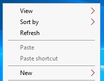
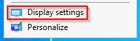
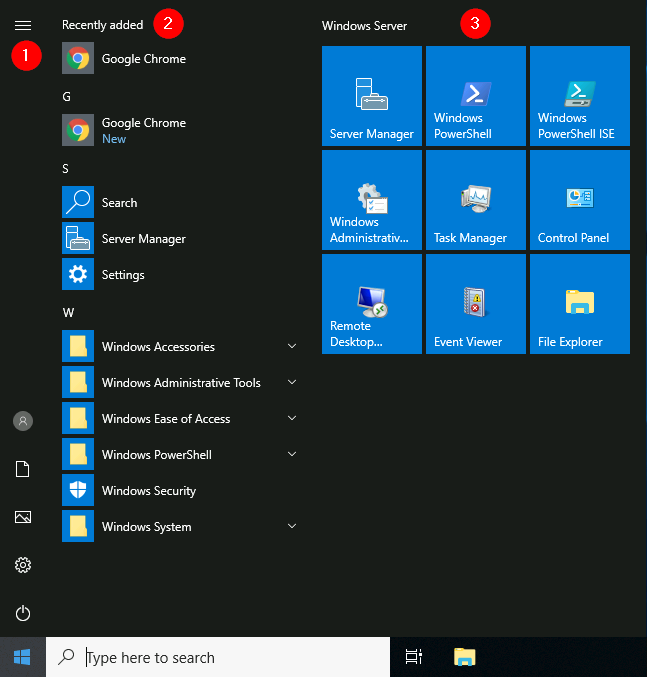

Windows Editions

The Windows operating system has a long history dating back to 1985, and currently, it is the dominant operating system in both home use and corporate networks. Because of this, Windows has always been targeted by hackers & malware writers.

Windows XP was a popular version of Windows and had a long-running. Microsoft announced Windows Vista, which was a complete overhaul of the Windows operating system. There were many issues with Windows Vista. It wasn't received well by Windows users, and it was quickly phased out.

When Microsoft announced the end-of-life date for Windows XP, many customers panicked. Corporations, hospitals, etc., scrambled and tested the next viable Windows version, which was Windows 7, against many other hardware and devices. Vendors had to work against the clock to ensure their products worked with Windows 7 for their customers. If they couldn't, their customers had to break their agreement and find another vendor that upgraded their products to work with Windows 7. It was a nightmare for many, and Microsoft took note of it.

Windows 7, as quickly as it was released soon after, was marked with an end of support date. Windows 8.x came and left and it was short-lived, like Vista.

Then arrived Windows.

Windows 10 comes in 2 flavors, Home and Pro. You can read the difference between the Home and Pro [here](https://www.microsoft.com/en-us/windows-server).

Even though we didn't talk about servers, the current version of the Windows operating system for servers is [Windows Server 2019](https://www.microsoft.com/en-us/windows-server).

Many critics like to bash on Microsoft, but they have made long strides to improve the usability and security with each new version of Windows.

Note: The Windows edition for the attached VM is Windows Server 2019 Standard, as seen in System Information.

As of June 2021, Microsoft announced the retirement dates for Windows 10 [here](https://docs.microsoft.com/en-us/lifecycle/products/windows-10-home-and-pro?ranMID=24542&ranEAID=kXQk6*ivFEQ&ranSiteID=kXQk6.ivFEQ-M28j3qbUhtM2JFCT2wmhOA&epi=kXQk6.ivFEQ-M28j3qbUhtM2JFCT2wmhOA&irgwc=1&OCID=AID2000142_aff_7593_1243925&tduid=%28ir__uszrgcddyskfqz3fkk0sohz3wv2xuurc01kgzkod00%29%287593%29%281243925%29%28kXQk6.ivFEQ-M28j3qbUhtM2JFCT2wmhOA%29%28%29&irclickid=_uszrgcddyskfqz3fkk0sohz3wv2xuurc01kgzkod00&ranMID=24542&ranEAID=kXQk6*ivFEQ&ranSiteID=kXQk6.ivFEQ-4cKUPfbv9lM_IR2EX7K_hw&epi=kXQk6.ivFEQ-4cKUPfbv9lM_IR2EX7K_hw&irgwc=1&OCID=AID2000142_aff_7593_1243925&tduid=%28ir__feexvhocigkfqna9kk0sohznb32xutanagupypus00%29%287593%29%281243925%29%28kXQk6.ivFEQ-4cKUPfbv9lM_IR2EX7K_hw%29%28%29&irclickid=_feexvhocigkfqna9kk0sohznb32xutanagupypus00).

"Microsoft will continue to support at least one Windows 10 Semi-Annual Channel until October 14, 2025".

As of October 5th, 2021 - Windows 11 now is the current Windows operating system for end-users. Read more about Windows 11 [here](https://www.microsoft.com/en-us/windows?wa=wsignin1.0).

The Desktop (GUI)

The Windows Desktop, aka the graphical user interface or GUI in short, is the screen that welcomes you once you log into a Windows 10 machine. 

Traditionally, you need to pass the login screen first. The login screen is where you need to enter valid account credentials; usually, a username & password of a preexisting Windows account on that particular system or in the Active Directory environment (if it's a domain-joined machine). 

Traditionally, you need to pass the login screen first. The login screen is where you need to enter valid account credentials; usually, a username & password of a preexisting Windows account on that particular system or in the Active Directory environment (if it's a domain-joined machine). 
1.The Desktop
2.Start Menu
3.Search Box (Cortana)
4.Task View
5.Taskbar
6.Toolbars
7.Notification Area

The Desktop

The desktop is where you will have shortcuts to programs, folders, files, etc. These icons will either be well organized in folders sorted alphabetically or scattered randomly with no specific organization on the desktop. In either case, these items are typically placed on the desktop for quick access. 

The look and feel of the desktop can be changed to suit your liking. By right-clicking anywhere on the desktop, a context menu will appear. This menu will allow you to change the sizes of the desktop icons, specify how you want to arrange them, copy/paste items to the desktop, and create new items, such as a folder, shortcut, or text document.

Under Display settings, you can make changes to the screen's resolution and orientation. In case you have multiple computer screens, you can make configurations to the multi-screen setup here. 

Note: In a Remote Desktop session, some of the display settings will be disabled. 

You can also change the wallpaper by selecting Personalize. 

The Start Menu
In previous versions of Windows, the word Start was visible at the bottom left corner of the desktop GUI. In modern versions of Windows, such as Windows 10, the word 'Start' doesn't appear anymore, but rather a Windows Logo is shown instead. Even though the look of the Start Menu has changed, its overall purpose is the same. 

The Start Menu provides access to all the apps/programs, files, utility tools, etc., that are most useful. 

Clicking on the Windows logo, the Start Menu will open. The Start Menu is broken up into sections. See below.

